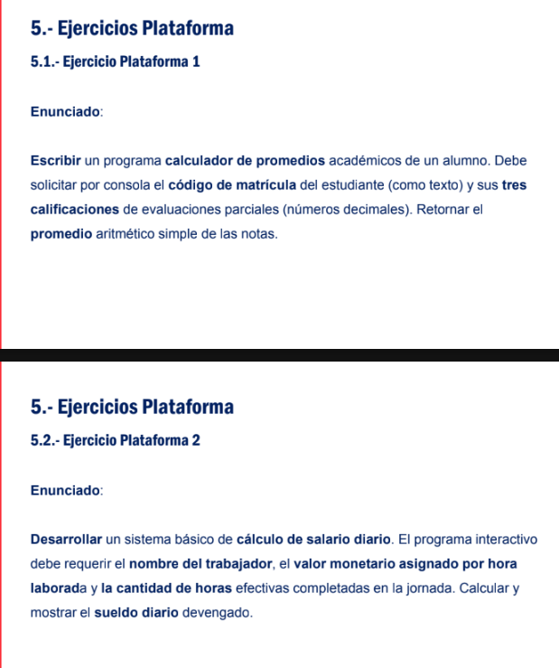

# Desarrollo - Ejercicios de Java

## Descripción

Programa desarrollado en Java como parte del **Curso Básico de Java - FAP**.

## Tecnologías

- Java
- JDK 17+
- IntelliJ IDEA

---
**Curso:** Java Básico - FAP

---

## Ejercicio Sesion 2

### Sistema de Promedios y Salarios

**Funcionalidades:**
- Calcular el promedio de tres calificaciones de un estudiante.
- Calcular el salario de un trabajador según las horas trabajadas y el valor por hora.

